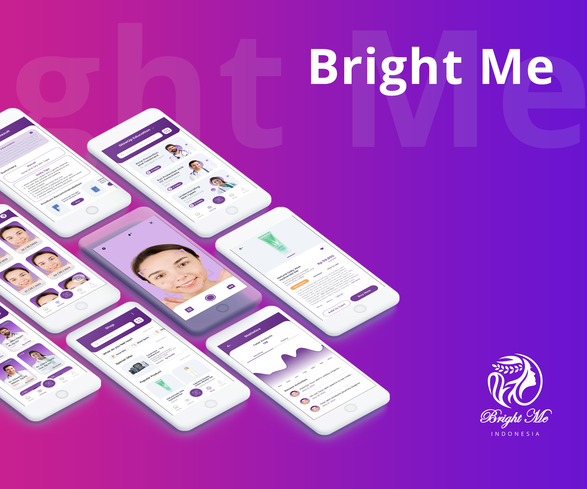

# Bright Me

  

## Skin Analysis and Smart Beauty Application  
Bright Me is designed with an attractive appearance and is easier for users to use. The first main feature of Bright Me is the AI Skin Analyzer which allows users to find out the skin type and skin diseases on their face. The second is Skincare Recommendation which provides several skincare product recommendations based on the user's facial problems.

# Install
You can install The Bright Me on your Android device by downloading .apk file via [this link](https://drive.google.com/file/d/1Ziic_EjmgYE92bsVD2-uUAqqqWNP68Tq/view?usp=sharing).

# Contributors :
- [Aurel Sukianto](https://github.com/aureliasknt) as Project Manager & Machine Learning Developer
- [Farkhan](https://github.com/farhanalmoza) as Machine Learning Developer
- [Honestyan Didyafarhan Atthariq](https://github.com/honestyan/) as Cloud & Backend Developer
- [Hafizh Abid Wibowo](https://github.com/hfzh) as Cloud & Backend Developer
- [Ratna Sih Pinasti](https://github.com/gladiolusxr) as Mobile Developer
- [Fanny Nugrahani](https://github.com/gladiolusxr) as Mobile Developer

  
# Build with
- TensorFlow
- Docker
- Node.JS
- Express.JS
- Kotlin

# Features
The Bright Me app lets you:
- AI Skin Analyzer
- Skincare Recommendations

# Future features
- e-Commerce Skincare 
- Online Consultation
- Education
- Glow up Plan